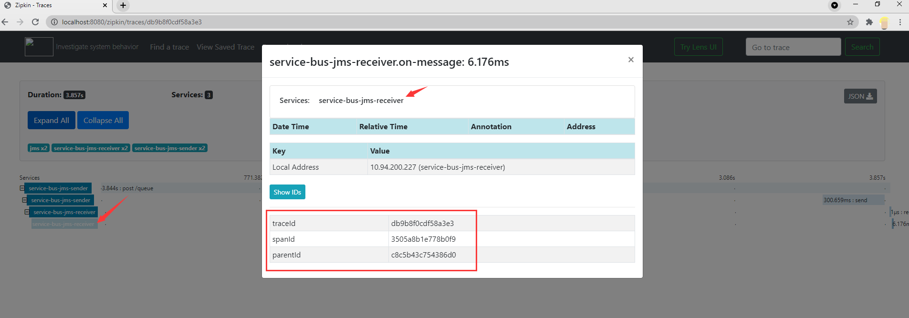

# Integrate spring cloud sleuth, opentelemetry and service bus
This repo used `Spring Cloud Sleuth` and `Opentelemetry` to track `Service Bus SDK`, `Zipkin` as a server for ui display.
There is a gap between service bus and zipkin, the dependency between consumers and producers in the service bus cannot be fully displayed. 
This document is some conclusions about tracing the service bus through the above methods.

## Introduction
This repo contains three parts, [ServiceBus JMS](#ServiceBus JMS), [ServiceBus Multi-binders](#ServiceBus Multibinders) and [ZipkinServer](#ZipkinServer).
Tracking the service bus, also refer to [Spring cloud sleuth otel][Spring cloud sleuth otel] and [Track Azure SDK for Java][Configure tracing in the Azure SDK for Java].

## Getting started
### Support
Running this repo will be charged by Azure. You can check the usage and bill at this [link](https://azure.microsoft.com/account/).
Go to [Azure portal](https://portal.azure.com/) and create the service by following this [link](https://docs.microsoft.com/azure/service-bus-messaging/service-bus-create-namespace-portal). 

### Prerequisites
- [Java Development Kit (JDK)][jdk_link] with version 11
- [Azure Subscription][azure_subscription]
- [Maven][maven] 3.0 and above

### Clone source
If you want to clone from master, jump to [Clone project from master branch](#clone-project-from-master-branch).

Note that there is no need to add a `version` as those are managed already by the project.

#### Clone project from master branch
It means cloning the master branch, all the code, dependencies, and readme files are up to date.

1. Clone code to local repo 

   ```
   git clone https://github.com/wujack778/Tracing-service-bus-by-sleuth-and-Opentelemetry.git
   ```
2. Traverse to the root directory

### ServiceBus JMS 
The module `azure-servicebus-jms-queue-supplier` and the module `azure-servicebus-jms-queue-consumer` are refer to [Service Bus Jms][Service Bus Jms Sample]
For the configuration of their `application.yaml`, please refer to [Service Bus Jms Readme][Service Bus Jms Config].

#### How to run
1. Run with Maven
    ```
    cd Tracing-service-bus-by-sleuth-and-Opentelemetry/azure-servicebus-jms-queue-consumer
    mvn spring-boot:run
    cd Tracing-service-bus-by-sleuth-and-Opentelemetry/azure-servicebus-jms-queue-supplier
    mvn spring-boot:run
    cd Tracing-service-bus-by-sleuth-and-Opentelemetry/zipkin-server
    mvn spring-boot:run   
    ```
2. Send a POST request to service bus queue.
    ```
    $ curl -X POST localhost:8899/queue?message=hello
    ``` 
3. Verify in your app's logs that a similar message was posted:
    ```
    Sending message
    Received message from queue: hello
    ```
4. Zipkin server will show the results of tracing [ZipkinServer](#ZipkinServer).

### ServiceBus Multi-binders
Module `azure-servicebus-queue-multibinders-consumer01`, Module `azure-servicebus-queue-multibinders-consumer02` and Module `azure-servicebus-queue-multibinders-supplier`
are refer to [Service Bus Multi binders][Service Bus Multi binders Sample]
For the configuration of their `application.yaml`, please refer to [Service Bus Multi binders Config][Service Bus Multi binders Config]

#### How to run
1. Run with Maven
    ```
    cd Tracing-service-bus-by-sleuth-and-Opentelemetry/azure-servicebus-queue-multibinders-consumer01
    mvn spring-boot:run
    cd Tracing-service-bus-by-sleuth-and-Opentelemetry/azure-servicebus-queue-multibinders-consumer02
    mvn spring-boot:run
    cd Tracing-service-bus-by-sleuth-and-Opentelemetry/azure-servicebus-queue-multibinders-supplier
    mvn spring-boot:run
    cd Tracing-service-bus-by-sleuth-and-Opentelemetry/zipkin-server
    mvn spring-boot:run   
    ```
2. Send a POST request to request to test the default binder.
    ```
    $ curl -X POST localhost:9000/messages1?message=hello
    ```
3. Verify in your app's logs that a similar message was posted:
    ```
     New message1 received: 'hello'
     Message1 'hello' successfully checkpointed
    ```
4. Send another POST request to test the other binder
    ```
    $ curl -X POST localhost:9000/messages2?message=hello
    ```
5. Verify in your app's logs that a similar message was posted:
    ```
     New message2 received: 'hello'
     Message2 'hello' successfully checkpointed
    ```
6. Zipkin server will show the results of tracing [ZipkinServer](#ZipkinServer).

### ZipkinServer
#### How to run

1. Request to zipkin server
Go back to your browser and request the following link http://localhost:8080/, you will see the following situation: 

2. View the tracing result

- Click this span 

- Every span, time consuming per span and request will be displayed. 

- Click every span, traceId, spanId, parentId will be displayed. 

- Click the Dependencies, the topological diagram of the dependencies will be displayed. 
    
    **JMS Result**  
    **Multi Binders Result**  


### Configurable properties
#### Common properties

| Properties                                                              | Description                                                                                    |
| ----------------------------------------------------------------------- | ---------------------------------------------------------------------------------------------- |
| **spring.application.name**                                             | Customize your application name |
| **server.port**                                                         | Customize your application server port|
| **spring.sleuth.sampler.probability**                                   | Probability of requests that should be sampled, eg 0.5 or 1|
| **spring.zipkin.base-url**                                              | Base url of your zipkin server |

 
<!-- LINKS -->
[azure_subscription]: https://azure.microsoft.com/free
[Configure tracing in the Azure SDK for Java]: https://docs.microsoft.com/en-us/azure/developer/java/sdk/tracing
[jdk_link]: https://docs.microsoft.com/java/azure/jdk/?view=azure-java-stable
[maven]: https://maven.apache.org
[Service Bus Multi binders Sample]: https://github.com/Azure/azure-sdk-for-java/tree/master/sdk/spring/azure-spring-boot-samples/azure-spring-cloud-sample-servicebus-queue-multibinders
[Service Bus Multi binders Config]: https://github.com/Azure/azure-sdk-for-java/blob/master/sdk/spring/azure-spring-boot-samples/azure-spring-cloud-sample-servicebus-queue-multibinders/README.md#examples
[Service Bus Jms Sample]: https://github.com/Azure/azure-sdk-for-java/tree/master/sdk/spring/azure-spring-boot-samples/azure-spring-boot-sample-servicebus-jms-queue
[Service Bus Jms Config]: https://github.com/Azure/azure-sdk-for-java/blob/master/sdk/spring/azure-spring-boot-samples/azure-spring-boot-sample-servicebus-jms-queue/README.md#config-the-sample
[Spring cloud sleuth otel]: https://github.com/spring-cloud-incubator/spring-cloud-sleuth-otel/blob/master/README.adoc
